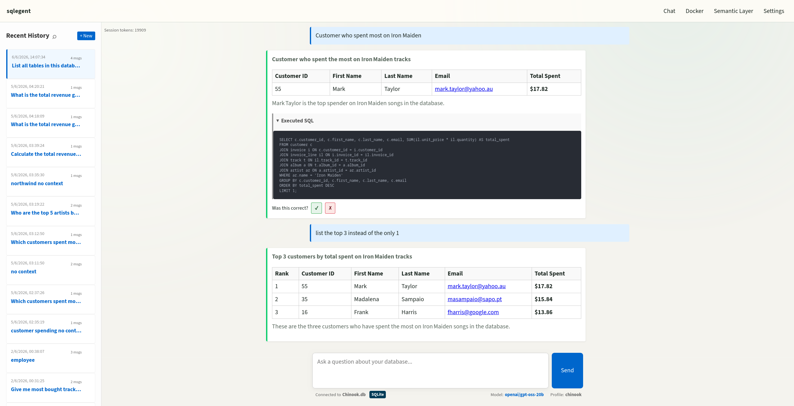
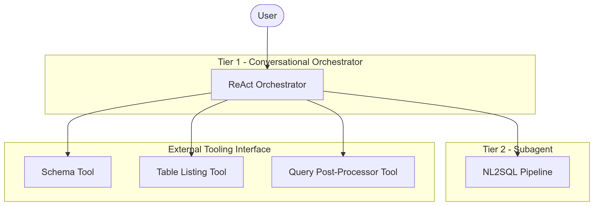
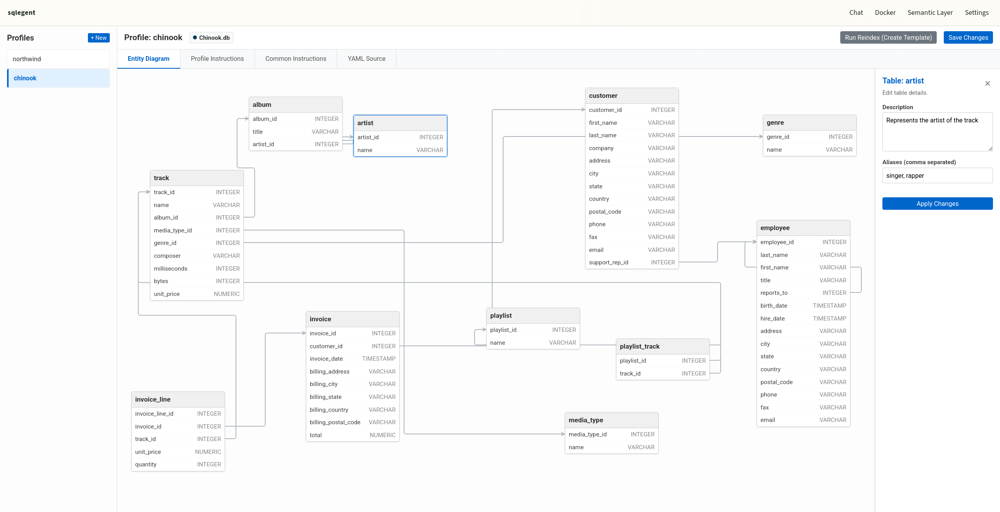

# sqlegent

sqlegent connects to a database, finds the tables and context relevant to a question, builds the SQL query, and can execute it and return the results depending on the configuration.

It is designed to work with smaller local models by keeping the context focused and only retrieving the information needed for each question. It supports six SQL dialects, human approval before execution, automatic discovery of Docker containers running supported databases, and a semantic layer for adding information that cannot be inferred from the database schema alone.



More [Screenshots](./assets/)


## Getting Started

Requires Python 3.10+ and `uv`.

```bash
# Install base dependencies
uv sync

# Install with optional drivers and WebUI support
uv sync --extra postgres --extra webui --extra mariadb --extra mssql
```

### Configuration

1. Copy `.env.example` to `.env`.
2. Set your LLM provider credentials.
3. Configure model parameters in `src/llm/model.py` if using non-standard endpoints (e.g., local Llama.cpp servers).

The application behavior is controlled by `AppConfig` in `src/config/app_config.py`. Key flags include:
*   `HUMAN_SQL_REVIEW`: Enable pre-execution query approval.
*   `EXECUTE_SQL_QUERIES`: Allow database execution.
*   `ENABLE_CONTEXT_LAYER`: Toggle semantic memory.

## Usage

### CLI

Run the interactive terminal interface.

```bash
# Default mode (auto-selects orchestrator or direct NL2SQL)
uv run src/main.py

# Force Conversational Orchestrator mode
uv run src/main.py --chat

# Force Direct NL2SQL pipeline mode
uv run src/main.py --nl2sql
```

### Web UI

Start the FastAPI server for a graphical interface with persistent sessions, visual graph tracing, and semantic layer editing.

```bash
uv run src/webui/main.py
```

Access at `http://localhost:8000`.


### MCP Server

Expose database tools and whole agent to other AI agents via Model Context Protocol.

```bash
uv run src/mcp_server.py
```

## Architecture Details

The system utilizes a **Two-Tiered Architecture** to balance flexibility with determinism.

### Tier 1: Conversational Orchestrator
A lightweight ReAct loop that manages user interaction. It decides whether to engage in general chat or invoke the specialized NL2SQL subagent. It resolves ambiguous follow-ups before they reach the database.

**Tools exposed to Orchestrator:**
*   `call_nl2sql_tool`: Invokes the full Tier 2 pipeline.
*   `get_schema_tool_with_cache`: Quick lookup of table structures.
*   `list_tables_with_cache`: Fast enumeration of available tables.
*   `quick_fix_query_tool`: Applies minor edits (LIMIT, ORDER BY) to previous results without re-running the full pipeline.




### Tier 2: NL2SQL Subagent
A deterministic state graph. It does not decide its own path; it follows strict edges with internal self-correction loops. This design allows smaller models to perform reliably by reducing cognitive load on the LLM.

**Pipeline Flow:**
1.  `question_synthesis`: Rewrites fragmented inputs into standalone, unambiguous queries.
2.  `retrieve_context`: Fetches relevant schema snippets and verified past queries using sparse retrieval.
3.  `generate_query`: Produces SQL based on synthesized question and context.
4.  `check_query`: Validates syntax and safety constraints.
5.  `run_query`: Executes against the target database.
6.  `analyze_result`: Handles empty sets, errors, or success cases.

[NL2SQL Pipeline Graph](./assets/tier2_nl2sql.png)

### Semantic Layer & Context

Context is injected per-node to manage token limits precisely. The semantic layer stores business logic, aliases, and relationships in YAML format within `semantic/`.

**Example Enhancement:**

```yaml
- name: Artist
  description: Musical artist entity used for attribution in sales analytics.
  aliases: [artists, musician, band]
  columns:
    - name: ArtistId
      description: Primary key of the artist.
```
also in webui:


For detailed configuration of models, relationships, and custom instructions, refer to the dedicated [Semantic Layer Documentation](./semantic/README.md).

### Project Layout


~~~text
src/agent/               NL2SQL pipeline
src/orchestrator/        conversational orchestrator
src/tools/               database and agent tools
src/app/                 shared runtime helpers
src/context_layer/       semantic context storage and retrieval
src/docker_connection/   Docker discovery and connection helpers
src/cli/                 terminal flows
src/webui/               FastAPI web UI
src/config/              application and database configuration
src/llm/                 model wiring
src/utils/               shared utilities
semantic/                semantic models and MDL files
infra/docker/            Docker test containers
~~~

### Retrieval Strategy

The system uses **sparse retrieval** instead of dense vector embeddings for metadata and schema lookups. This reduces resource consumption and improves precision on structured data while avoiding the overhead of embedding models. Query memory retrieves verified successful patterns to guide future generations.
